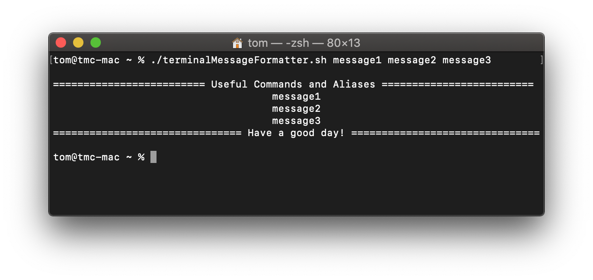
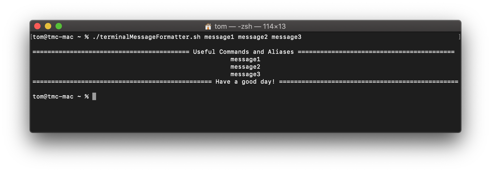

# terminal-message-formatter
A message formatter for your terminal.
It's a bash script that takes messages as parameter and outputs them in a pretty format.

# initialisation
`chmod 700 terminalMessageFormatter.sh`

# usage
move to the holding directory of the script
`./terminalMessageFormatter.sh message1 message2 message3 ...`

# features
Script output scales to terminal window width:

