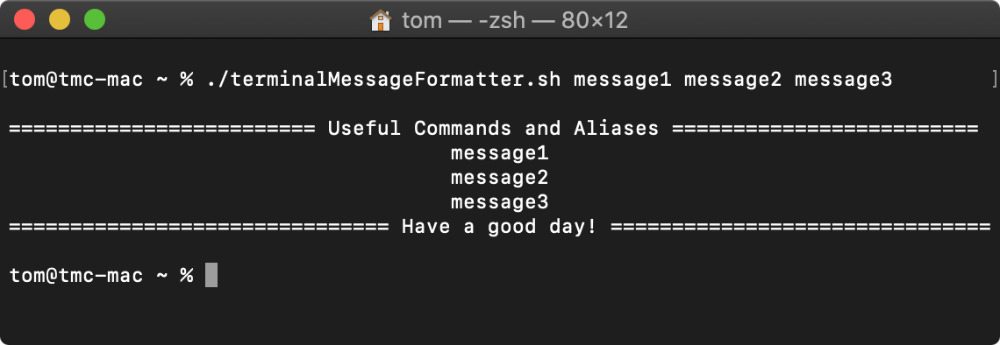
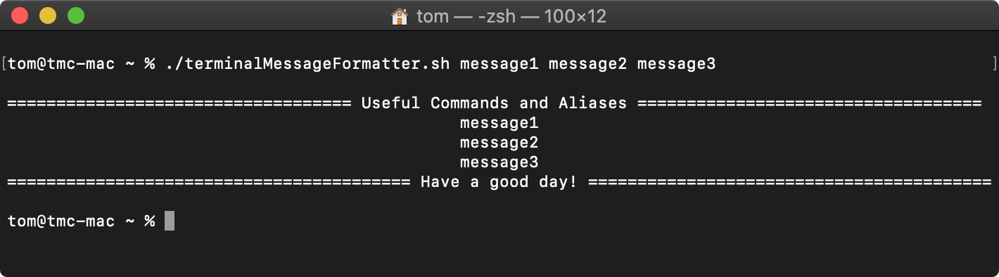

# terminal-message-formatter
A message formatter for your terminal. 
A bash script that prints out argument-given messages, as depicted below.

# initialisation
1. Move to the directory in which the script is located: `cd ~/Downloads`
2. Ensure the script has sufficient permissions: `chmod 700 terminalMessageFormatter.sh`

# usage
1. Move to the directory in which the script is located: `cd ~/Downloads`
2. Execute the script with your messages as arguments: 
`./terminalMessageFormatter.sh message1 message2 message3 ...` 

# features
Posted messages scale to the window width of the terminal session:

